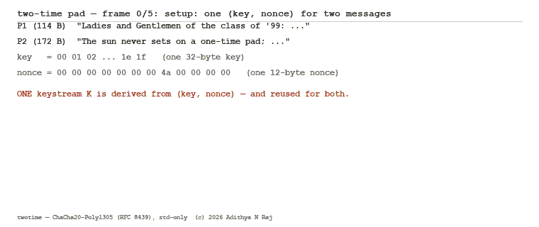
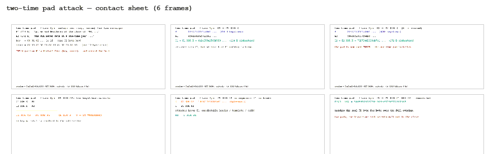

# Twotime

[](https://www.rust-lang.org/)
[](https://doc.rust-lang.org/std/)
[](https://www.rfc-editor.org/rfc/rfc8439)

[](https://www.rust-lang.org/tools/install)
[](LICENSE)


**ChaCha20-Poly1305 AEAD (RFC 8439) rebuilt from scratch in Rust (`std` only), with the *two-time pad* — the one construction failure that turns a stream cipher into a codebook — reproduced byte-exact, and every published RFC test vector verified in a 43-check known-answer battery.**

Twotime is a research crate about a specific, historical class of failure: a
one-time pad used *twice*. The name is the attack. The crate implements the
full RFC 8439 stack — ChaCha20 (20-round block function), Poly1305 (mod
`2^130 − 5` MAC), and the AEAD_CHACHA20_POLY1305 composition — with zero
dependencies, then studies the failure mode with a byte-exact reproduction,
a 13-case forgery-rejection battery, and an avalanche study that contrasts
the stream cipher's exact linearity with the MAC's diffusion.

No crates. No wall clock. No RNG. Every artifact this repo can produce is a
pure function of the embedded RFC 8439 test vectors, and re-running anything
— the battery, the PDF dossier, the SVG animation — produces byte-identical
output. That claim is not a slogan; it is attested in
`assets/attestation.txt` by a dual-run SHA-256 diff.

---

## What is in the box

| Module | What it is |
| --- | --- |
| `chacha` | The ChaCha20 block function: the RFC §2.1 quarter round verbatim, 20 rounds (10 column/diagonal pairs), add-original-state, little-endian serialization |
| `poly` | Poly1305 over the 130-bit field `F = Z/(2^130 − 5)` — a `u128 + u32` representation, 5×5 schoolbook multiply in base 2^32, and a **two-fold reduction** exploiting `2^130 ≡ 5 (mod P)` |
| `aead` | AEAD_CHACHA20_POLY1305 (RFC §2.8): one-time key from block 0, ciphertext from block 1, the §2.8.1 Poly1305 message layout, constant-time tag compare |
| `twotime` | The namesake: two plaintexts under one `(key, nonce)`, keystream cancellation `C1 ⊕ C2 = P1 ⊕ P2`, and full recovery `P2 = P1 ⊕ C1 ⊕ C2` |
| `forgery` | A 13-case forgery-rejection battery built on the §2.8.2 message: one control that must be accepted, twelve forgeries that must be rejected |
| `avalanche` | One-bit-flip diffusion: 256 key bits + 96 nonce bits → tag Hamming weight, plus the stream cipher's contrast case (plaintext bit → ciphertext bit) |
| `kats` | The 43-check battery: every published RFC 8439 vector (§§2.1.1–2.8.2, Appendices A.1–A.5) |
| `battery` | The verification report (sections 1–4) |
| `pdf` | A hand-rolled deterministic PDF 1.4 writer (base-14 fonts, fixed `/ID`, fixed creation dates) that typesets the report into the committed dossier |
| `svg` | The six-frame SMIL animation of the attack (no JS) and its static contact sheet; `tools/make_gif.py` rasterizes the six committed frames to `assets/anim.gif` / `assets/sheet.gif` (deterministic Pillow) |
| `crypto` | A zero-dependency SHA-256 (FIPS 180-4) used for the attestation digests |
| `attest` | The dual-run byte-identity attestation |

Every number below is reproducible from the committed artifacts or from
`cargo test` / the CLI.

---

## The 130-bit field: why Poly1305 is a representation problem

Poly1305 reduces its accumulator modulo the prime

```
P = 2^130 − 5
```

which is **130 bits — two bits too wide for a `u128`**. The natural
"just use `u128` and mask" shortcut is silently wrong: the accumulator
genuinely reaches values with bit 129 set (the RFC's own §2.5.2 printout
shows 33-digit intermediate accumulators, and A.3 #5–#11 are engineered to
land on the reduction boundary). `poly.rs` therefore represents a field
element as

```
F { lo: u128, hi: u32 }    // value = lo + hi · 2^128,  hi < 4
```

and does the arithmetic with explicit bit-width bounds:

- **Bounds.** After clamping, `r < 2^124`; each block `m < 2^129` (a full
  16-byte block is `2^128 + low`, i.e. 129 bits — the `hi = 1` path); the
  sum `acc + m < 2^131` (transient `hi ≤ 5`, still five limbs). The product
  is `< 2^124 · 2^131 = 2^255` in the worst case, and `< 2^261` in general —
  nine base-2^32 limbs (288 bits) hold it with the top carry provably zero
  (`debug_assert!` guards this on every multiply).
- **Multiply.** 5×5 schoolbook over the 32-bit limbs: 25 `u128` column sums,
  then a base-2^32 normalize into nine limbs.
- **Two-fold reduction.** Split the 9-limb product as
  `m = L + H·2^130`, where the 130-bit split *straddles a limb boundary*
  (`130 = 4·32 + 2`): the two low bits of limb 4 join the top 30 bits of
  limb 8 to form `H`'s low word. Since `2^130 ≡ 5 (mod P)`,
  `m ≡ L + 5H (mod P)`. The first fold gives `S1 < 2^134` (still an `F`);
  the second fold — `5·(S1 >> 130) ≤ 45` — gives `S2 < P + 45`, so **one
  conditional subtract of `P`** lands the result in `[0, P)`. The tag is
  then `(acc + s) mod 2^128 = acc.lo() + s`, the high part vanishing modulo
  2^128.

The KAT battery pins all of this: RFC §2.5.2 publishes its three
intermediate accumulators as **unpadded 33-digit hex** (the `hi = 2`
elements) and the full 130-bit `acc + s` sum, and A.3 #5–#11 exercise the
reduction edges — a 130-bit partial reduction (#5), a mod-2^128 tag
overflow (#6), the all-ones limb (#7), the polynomial part equal to
`P` exactly (#8, tag 0), `P − 1` (#9), and 131-bit `5H + L` intermediates
(#10, #11). All pass against the published tags.

---

## The two-time pad, byte-exact

The canonical scenario (fixed key `00 01 02 … 1e 1f`, fixed nonce
`00 00 00 00 00 00 00 4a 00 00 00 00`, the 114-byte "sunscreen" plaintext
`P1` and a 172-byte second message `P2`) is a pure constant — no clock, no
randomness — and the attack is the arithmetic:

```
C1 = P1 ⊕ K      C2 = P2 ⊕ K      (K derived once from (key, nonce))
────────────────────────────────────────────────────────
C1 ⊕ C2 = P1 ⊕ P2        (K ⊕ K = 0 — the keystream cancels)
P2 = P1 ⊕ C1 ⊕ C2        (attacker who knows P1 recovers P2)
```

The report (SECTION 2) and the animation verify both lines at the byte
level: `C1 ⊕ C2 == P1 ⊕ P2` over the 114-byte overlap, and the recovered
`P2` equals the true `P2` byte-for-byte. A control test pins the
converse: two *different* nonces do **not** cancel — `C1 ⊕ C2 ≠ P1 ⊕ P2`
— so the failure is exactly the key/nonce reuse and nothing else.

---

## Avalanche: one bit in, how many bits out?

The same battery measures two opposite behaviours (SECTION 4), pinned in
tests to the measured values:

| Flipped bit | Output | Flipped bits | Reading |
| --- | --- | --- | --- |
| plaintext bit 0 | 114-byte ciphertext (912 bits) | **1 of 912** | ChaCha20 is a permutation of the stream: bit-in → bit-out, exactly |
| plaintext bit 0 | 128-bit tag | **72 of 128** | the MAC avalanches: one bit in, most of the tag moves |
| each key bit (256) | 128-bit tag | mean **63.97** / min 48 / max 80 | the clamped `r` mixes through `m·r` |
| each nonce bit (96) | 128-bit tag | mean **64.71** / min 51 / max 80 | the nonce reaches the tag via the one-time key |

The contrast is the exhibit: the stream cipher is *exactly* linear (it is a
fixed permutation per key), while the MAC is a hash — one bit of input
disturbs about half the 128-bit output.

---

## Forgeries must fail, and 12 of 12 do

The forgery battery (SECTION 3) starts from the valid §2.8.2 message
(constant `07 00 00 00`, IV `40 … 47`, 12-byte AAD, the 114-byte
sunscreen plaintext) and tries twelve attacks: three tag-bit flips (bits
0, 71, 127), a zeroed tag, a first-byte and a last-bit ciphertext flip, a
one-byte-truncated ciphertext, a ciphertext swapped in from another
message under the same `(key, nonce)`, an AAD byte flip, an IV flip
(new keystream, original tag), a constant flip, and a key-bit flip. One
control (the untouched message) must be accepted; every forgery must be
rejected by the constant-time tag compare. All 13 cases pass.

---

## Determinism

1. **`assets/report.txt`** — the four-section verification report: the 43
   KATs, the byte-exact attack, the forgery battery, and the avalanche
   table. A pure function of embedded constants.
2. **`assets/dossier.pdf`** — the same report typeset by the hand-rolled
   deterministic PDF writer: four pages, base-14 fonts, fixed `/ID` and
   creation dates, verified by re-parsing with an independent PDF library
   (page count, object resolution, text extraction).
3. **`assets/attestation.txt`** — the report and the dossier are each
   generated **twice** in-process and SHA-256-compared. Empty diff, by
   construction, because nothing reads the clock:

```
run 1   : report.txt sha256 = 84ca6ba59e8672785c5d964e6e823789b4298989f04abaed159eca02c317f69a
run 2   : report.txt sha256 = 84ca6ba59e8672785c5d964e6e823789b4298989f04abaed159eca02c317f69a
run 1   : dossier.pdf sha256 = e35696b94aa22b9ccc4c8cef5e8b74c571ad3ebe6b0c79db3f4a60aa8d81c13e
run 2   : dossier.pdf sha256 = e35696b94aa22b9ccc4c8cef5e8b74c571ad3ebe6b0c79db3f4a60aa8d81c13e
verdict : BYTE-IDENTICAL (dual-run diff empty)
```

The cross-process property was additionally checked by regenerating every
artifact in three separate process invocations: all five artifacts came out
byte-identical. The attack itself is the animation:

<p align="center">
  
</p>

<p align="center">
  
</p>

*The two-time pad, six frames: setup, `C1 = P1 ⊕ K`, `C2 = P2 ⊕ K` (same
`K`), the cancellation `C1 ⊕ C2 = P1 ⊕ P2`, the exposed `P1 ⊕ P2`, and the
byte-exact recovery of `P2`. The GIFs are a deterministic raster of the
committed SVG frames (`assets/anim.svg` is the SMIL original, opens in any
browser); `python tools/make_gif.py` reproduces them byte-for-byte.*

---

## Building and running

Rust 1.94+ (any recent stable), no dependencies:

```
cargo test                       # 73 tests
cargo run --release -- demo      # the two-time pad, byte-exact
cargo run --release -- kats      # RFC 8439 KAT battery summary (43 checks)
cargo run --release -- battery   # -> assets/report.txt
cargo run --release -- dossier   # -> assets/dossier.pdf
cargo run --release -- attest    # -> assets/attestation.txt
cargo run --release -- svg       # -> assets/anim.svg + assets/frames.svg
python tools/make_gif.py         # -> assets/anim.gif + assets/sheet.gif
```

Every artifact command prints the SHA-256 of what it wrote, so any re-run is
self-verifying.

## References

- D. A. Wong, J. Salowey, A. Freier, P. E. Rhoades,
  [*ChaCha20 and Poly1305 for IETF Protocols*](https://www.rfc-editor.org/rfc/rfc8439),
  RFC 8439, IETF, June 2018 (all 43 KAT vectors are embedded in `src/kats.rs`).
- D. J. Bernstein, *ChaCha, a new family of streaming ciphers*
  ([the ChaCha family](https://cr.yp.to/chacha.html)), CHES 2008 rump
  session; [*The Poly1305-AES Message-Authentication Code*](https://doi.org/10.1007/11502760_3),
  2005 (the quarter-round variant and the clamped key split).
- NIST, [*FIPS 180-4*: Secure Hash Standard](https://doi.org/10.6028/NIST.FIPS.180-4).

KAT provenance: every embedded vector was extracted programmatically from
the RFC 8439 source text by `tools/extract_vectors.js` (per-vector line
ranges over the hex dumps), producing the Rust-ready constants in
`tools/extracted.txt`, which were then transcribed line-by-line into
`src/kats.rs`. The extractor is committed so the transcription can be
re-audited against any copy of the RFC text.

---

<p align="center">© 2026 Adithya N Raj</p>
